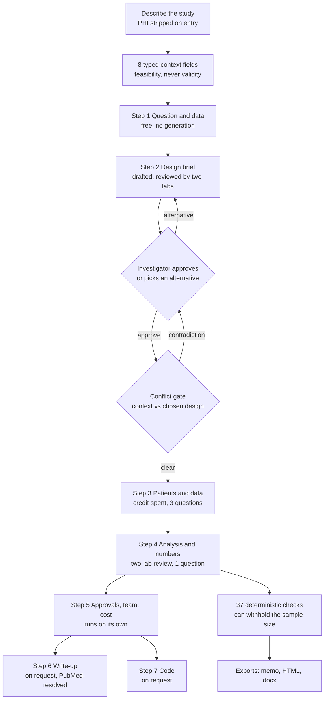
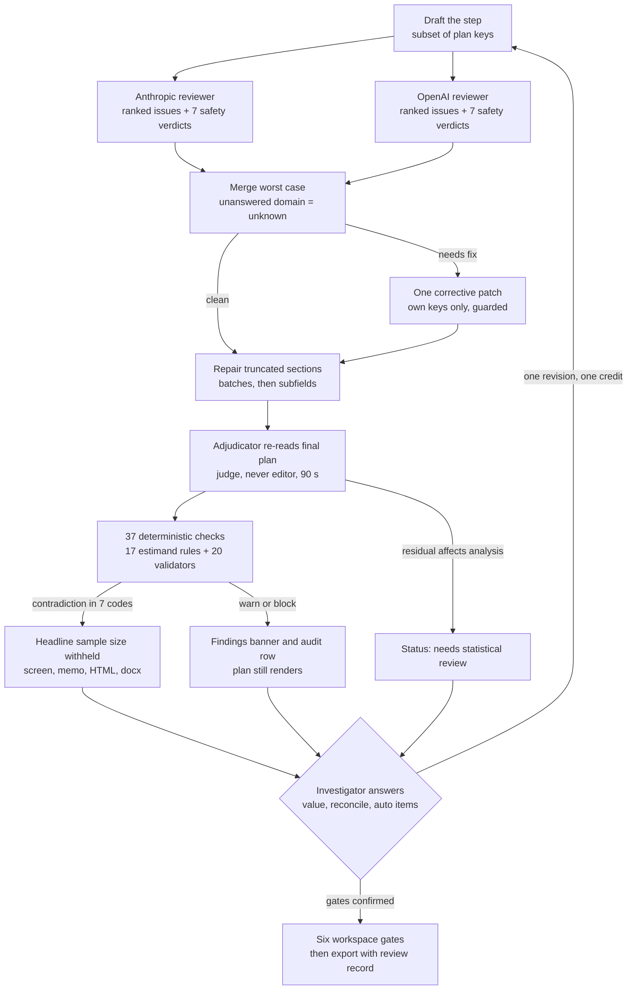

# Mallard Study Design Process

Source of truth: https://claude.ai/code/artifact/fab5d454-18b6-441c-958b-9bb8b57ec877 (living copy; this file is a Markdown export).

2026-09-17 · Juleon Rabbani

## Purpose and scope

This document describes how [Ask Mallard](https://askmallard.com) takes a clinician from a plain-language study description to a study design plan it is willing to print, and what it asks along the way that a general-purpose chatbot does not. It is written from the Ask-Mallard source code and its project documentation as of 17 September 2026, and it reports only what the app does today. Where Mallard does not yet help, the Limitations section says so rather than describing a feature that may come later.

Mallard's own framing is the useful one: models draft and review, and deterministic code decides what may be printed. A plan is never the output of a single model. The design is settled first in a free design brief, the plan is then built in seven steps in the order a study develops, and a fixed set of non-AI statistical checks runs on every step and can withhold a sample size the plan cannot justify. Mallard states that it is a planning aid for a qualified person to check, not a substitute for a biostatistician or an IRB.

The audience for this document is an investigator, a program director or a statistician deciding whether the process is trustworthy, and a developer deciding what to build next. Appendix A lists every decision the investigator makes before a final plan and how each one changes the recommended plan.

## The process from question to plan

A valid plan takes two stages and seven steps: a free design brief that settles the design, then a plan built in the order a study develops, with one credit spent at step 3. The investigator approves the design between the stages, and that approval is the only point where the pipeline waits for a person.

Read top to bottom: the brief loop on the left is free and repeatable, the credit is spent once at step 3, and the deterministic layer at the bottom has the last word on anything that decides a sample size.

| Step | What it asks | Review depth | Investigator questions | How it runs |
| --- | --- | --- | --- | --- |
| 1. Your question and your data | What am I asking, has it been answered already, what records do I have? | None | 0 | Free, nothing generated |
| 2. Your design | How should I study it, and what does each choice mean? | Anthropic and OpenAI reviewers, worst case wins | 2 | Free brief, bounded by a monthly allowance |
| 3. Your patients and your data | Who is in, what is measured, where records come from, who must say yes | Deterministic checks | 3 | Spends the credit, requires sign-in, pauses for answers |
| 4. Your analysis and how many you need | How are the numbers compared, and how many patients does that take? | Anthropic and OpenAI reviewers, corrective pass, adjudication | 1 | On the investigator's press |
| 5. Approvals, team and cost | Who approves, what it costs, what to do Monday | Deterministic checks | 0 | Follows step 4 automatically |
| 6. Writing it up | Abstract, methods paragraph, background with references | Deterministic checks | 0 | On request |
| 7. Running it | Code in the investigator's software, tables and figures | Deterministic checks | 0 | On request |

Three properties of this order matter for validity. The design is decided before anything downstream is drafted, because a plan built on the wrong design is wrong throughout. Each step drafts only its own sections and may not rewrite an approved one, and the investigator's answers are pinned as facts no later step can overwrite. Re-running an earlier step marks everything after it stale, so a changed population or analysis cannot leave a sample size that was computed for the old one.

Source: the deployed pipeline description in the Ask-Mallard repository (docs/pipeline/pipeline.html, build 2026-09-17m) and the step definitions in src/steps.js.

## What Mallard collects that a general model does not

The difference is not the questions but their type. A general chatbot reads free text, fills gaps from its priors, and answers the same question with a weaker method if the asker sounds under-resourced. Mallard asks for typed facts, refuses to invent what was not supplied, and lets those facts govern what the deterministic layer will allow to print. The rule at the head of every context block is that context governs feasibility, never validity: the simplest defensible method comes from the question, and resources only decide whether it is reachable.

| What Mallard collects | The malpractice it guards against | What changes in the plan |
| --- | --- | --- |
| Eight typed context fields: primary use, deliverable, horizon, data state, data source, funding, team roles, who runs the analysis, plus who leads the design | Letting the investigator's software or team size choose the method. A test fails if any prompt says "simplest valid analysis" or "completed in spreadsheet" | Funding and a full team can only route the draft to a stronger model. The write-up sections follow the primary use. A novice analyst gets SPSS steps plus R and plain-register prose |
| Data state compared against the brief's typed assignment mechanism | Planning a randomised or prospective study on records already in hand, or the reverse | Four typed conflicts, three of them blocking, disable Generate until the investigator answers which is true |
| Deadline as two fields: a duration and what must exist by then, with a typed "study must finish" flag | Sizing a three-year cohort for a six-month results deadline, or refusing a study that only needs a proposal by then | A six-month results deadline against a prospective design blocks; a six-month proposal deadline does not |
| Team roles by name, nine of them, and a report of who is missing | A plan that assumes a statistician nobody has | The support sentence names the gap; "full" support means a statistician plus someone who handles the data |
| Aims with a role (primary confirmatory, secondary confirmatory, exploratory), an intended claim, and a hypothesis required for confirmatory aims | Confirmatory claims built on exploratory analyses, and hypotheses written after the results | A deferred aim is excluded from generation and gates. Multiplicity fields become required once any confirmatory aim exists |
| Aims drafted with bracketed placeholders, never invented facts, and a causal aim never reworded as an association | A follow-up window or comparator the model made up, or a causal question silently downgraded | The investigator fills every placeholder; an override of the aims check needs a written reason |
| A typed estimand: target, population, exposure, comparator, outcome and its type, summary measure, time horizon, framing, unit of inference, assignment mechanism, clustering, repeated measures, competing events | A sample-size formula, analysis and figure that each answer a different question | Seventeen estimand rules compare sizing, analysis and exhibits to the typed fields. A contradiction withholds the headline number everywhere |
| Every variable with a role per aim (outcome, exposure, confounder, mediator, effect modifier, selection factor, design, descriptive), measurement format, timing, source, availability, missingness and an owner | Adjusting for a mediator, adjusting for a variable measured after exposure, and an analysis that needs a variable nobody records | A variable that is both confounder and mediator is a blocking contradiction. The diagram is labelled a proposed structure. The variable map explicitly refuses to choose an adjustment set |
| Missing data assumption-first: the mechanism is named before a method | Multiple imputation chosen by default, when it is right under MAR and wrong under several plausible alternatives | A method named with no assumption behind it warns; a plausible MNAR mechanism calls for a delta or tipping-point sensitivity |
| A feasibility interview with a basis for each answer: checked result or planning assumption, and a named owner | Treating a guessed record count as evidence of power | Answers are planning prompts, never evidence. Tasks with owners block the design decision until closed |
| Design conditions from the brief, each with a record-level check, a numeric threshold and the design to switch to if it fails | Assuming the conditions a design depends on rather than testing them | Each condition lands as a feasibility row answered Confirmed, Need to check or Not available |
| Count reconciliation with availability typed as entered or not yet established, and a sizing approach per row: calculated minimum, planning cap, census or fixed sample | Reporting that entered counts "meet their requirement" when the count was typed to get past a gate | A count not yet established carries a provisional caveat into the printed package |
| Sizing inputs typed per method, with a record of which inputs the investigator supplied versus defaulted, and a required literature source | A power calculation whose inputs are unlabelled assumptions | The app recomputes the number from the inputs. Editing an input clears the recorded result until the investigator recalculates |
| Multiplicity: the family, the method and its sizing implication | Several confirmatory comparisons at an unadjusted alpha | Required whenever a confirmatory aim exists |
| An analysis contract per aim: primary analysis, alternatives, selection rationale, covariates, missing data, sensitivity analyses, subgroups, analysis population | Choosing the analysis after seeing the data | All eight fields are required before analysis and sizing are confirmed; a subgroups field that prespecifies nothing still counts as untested effect modification |
| Investigator answers to the model's own questions, pinned as facts | A later step quietly overwriting what the investigator said | Pinned facts are re-emitted verbatim into every later step; "not sure" is deliberately not pinned |
| Citations as PubMed queries, never text | Fabricated references | Each query is resolved live; a record that does not exist cannot appear, and a found record is marked as needing confirmation that it supports the use |
| Protected health information stripped on upload and again at Generate | Identifiers reaching a model or a saved plan | Warnings report categories and counts only; study periods, doses and codes survive |

A general model can be prompted to ask any of these questions. What it cannot do is refuse to print a number when the answers contradict each other, and that refusal is the part of Mallard that reduces malpractice risk rather than merely documenting it.

Sources: src/context.js, src/workspaceFlow.js, src/aimsAnalysis.js, src/variablePlanning.js, src/variableMeasurement.js, src/feasibilityInterview.js, src/countReconciliation.js, src/estimand.js, src/steps.js and the statistical-correctness rules in CLAUDE.md of the Ask-Mallard repository.

## The feedback loop: review, checks and revision

A generated step is never accepted as drafted. It passes through two independent model reviews, one guarded corrective revision, an adjudicator that judges but never edits, and then the deterministic layer, which alone decides what may be printed. The investigator closes the loop by answering what only they can know, and each answer costs one revision.

Read top to bottom: the two reviews are the only concurrent step, the deterministic layer sits below every model and cannot be overruled by one, and the loop back to the draft is driven by the investigator's answers, not by the models re-trying.

**Two model reviews, merged worst case.** Each reviewer returns a capped list of ranked issues plus a verdict on seven safety domains: design matches question, estimand matches analysis, sizing matches design and estimand and analysis, clustering handled, randomisation claims supported, missing data coherent, causal adjustment coherent. The domains are answered outside the issue budget because a ranking drops whatever came fifth without saying so. An unanswered domain is recorded as unknown, never as pass, and a concern reaches the revision even without an issue slot. Only the design brief and the analysis step get this review; every other step gets the repair pass and the deterministic checks.

**One guarded revision.** The corrective pass is a patch of changed keys, filtered to the step's own sections. A patch that changes a field's type, truncates a string, empties a section, or invents a reviewer response is dropped, and a revision that comes back thinner than the draft is rejected with the reason recorded. On the brief, the deterministic estimand checks feed the revision directly and the brief is re-emitted whole, because mutual consistency is the product.

**The deterministic layer has the last word.** The checks read the typed estimand, the sizing method, the recommended analysis, the diagram and the rendered exhibits, and compare them to each other. The validators the code runs include:

- Sizing against the estimand, the analysis and the design: a superiority formula under a non-inferiority framing, an events-per-variable floor for a prediction model, an individual-level formula for a clustered design, a closed form for mediation.
- Fabricated results: a stated power or sample size under a sizing method that performed no calculation is blocked.
- Causal structure: a variable listed as both confounder and mediator blocks, an exposure level in the adjustment set warns, a listed effect modifier with no interaction or subgroup analysis warns.
- Inference: cluster-robust or GEE inference with under 15 clusters and no small-sample method blocks, under 30 warns; randomisation inference on a typed non-randomised design warns.
- Missing data: a method with no MCAR, MAR or MNAR assumption named warns, as does imputation named alongside a complete-case primary analysis.
- Consistency: code that fits a model the methods never name blocks, a confirmatory analysis also listed as exploratory blocks, an RCT citing STROBE instead of CONSORT warns, and every sizing input without a provenance row warns.

**What failing looks like.** The plan is never blanked or regenerated by the checks, because a false positive that shows a blank screen destroys work a paid credit bought. Findings are severity-ranked and always rendered. Four consequences follow, in increasing weight.

| Outcome | Trigger | What the investigator sees |
| --- | --- | --- |
| Warning | Any warn-level finding | A banner above the plan, and the finding named inline in the audit's consistency row in every export |
| Block | Any block-level finding | The same banner, red, headed "This plan contradicts itself" |
| Headline withheld | One of seven headline-suppressing codes, or an unresolved reviewer point typed as affecting the sample size | No sample-size number anywhere; the panel says whether the reason is a contradiction, an open review point, or that no formula fits |
| Needs statistical review | An unresolved reviewer point affecting the primary analysis | A status carried to the screen, memo, audit and library card; the analysis stays visible |

**Closing the loop.** Every open finding, audit item and adjudication residual is collected into one form with three kinds of item: values only the investigator knows such as their SD or event rate, reconcile items where Mallard can resolve a contradiction once told which side is right, and mechanical fixes. One button sends the whole form as one revision. Separately, the guided workspace holds six gates, from question through feasibility, design, analysis and execution to finalisation, and each is confirmed only when its typed fields are complete and free of privacy findings. Finalisation additionally requires a named human reconciler, a review summary that states remaining limitations, a recorded code disposition and no open review comments. A biostatistician's design review, when requested, is pinned to a canonical copy of the scientific decisions and goes stale if any of them change.

Sources: src/validate.js, src/estimand.js, src/pipeline.js, src/fixup.js, src/workspaceFlow.js, src/workspaceDeliverables.js, netlify/functions/consult-work-background.js and docs/pipeline/pipeline.html in the Ask-Mallard repository.

## Where Mallard does not yet help

Mallard sizes fifteen design families deterministically, describes many more without a number, and says nothing useful about a further group. Its own methods page lists the refusals: IRB determinations, final interpretation of results, a sample size it cannot justify, replacing collaborators, and citations written from memory. The gaps below are taken from the code, the Learn library and the roadmap notes, not inferred.

**Design families by what the engine can do**

| Coverage | Design families | What the investigator gets |
| --- | --- | --- |
| Deterministic calculator, pinned against R | Two means (exact noncentral t), paired means, one mean, two proportions, one proportion, correlation, log-rank, logistic events-per-variable floor, linear subjects-per-variable floor, diagnostic accuracy precision, kappa precision, k-group ANOVA, single-proportion precision with clustering, cross-sectional stepped wedge (power only), interrupted time series (simulated power only), non-inferiority of two proportions | A headline number or power figure, recomputed by the app from typed inputs, with the assumptions printed |
| Described, deliberately not sized | Cluster-randomised and staggered rollouts, closed-cohort or incomplete stepped wedge, mediation, repeated-measures and longitudinal models, difference-in-differences, recurrent events, complex surveys beyond one proportion | The method is named and the plan says a simulation is required; no number is printed, and a stated power under this route is blocked as fabricated |
| Named method, no closed form in the catalog | Matched or nested case-control (Dupont 1988), prediction-model development and validation (Riley criteria), equivalence, non-inferiority on a mean or time-to-event | The method and its inputs are named in prose; the headline is empty |
| Learn page only, no plan or sizing support | Qualitative, systematic review and meta-analysis, economic evaluation, case series, regression discontinuity, control charts, network and diagnostic-accuracy meta-analysis | Explanation and a statement that Mallard does not run or size it |
| Keyword only, raises complexity and nothing else | Adaptive, interim and group-sequential, Bayesian, joint and multistate models, latent-variable models, MNAR, synthetic control, target-trial emulation, crossover, factorial | The study routes to the stronger drafting model; no dedicated design or sizing path exists |
| Not covered anywhere | Platform, basket and umbrella trials, SMART and adaptive treatment strategies, micro-randomised trials, dose-finding, diagnostic impact studies | Nothing beyond a possible complexity keyword |

**Known partial coverage stated on the page**

- Multi-arm trials scale a per-arm number by the arm count for two-means designs only. For proportions and time-to-event outcomes the figure covers one comparison, and Mallard does not choose a multiplicity adjustment.
- The paired calculation is continuous-only. A binary paired outcome, mixed one-site and two-site participants, or more than two sites per person are not sized.
- The one-proportion calculation is single-stage. The roadmap records as a confirmed gap that nothing stops it being used for a Simon two-stage design.
- Diagnostic accuracy sizes one test's precision, not a paired comparison of two tests.
- The non-inferiority calculator sizes one analysis with no dropout inflation and no per-protocol allowance.
- The stepped-wedge and interrupted-time-series engines return power, not a sample size, and both state what they do not model: small-cluster inference and closed cohorts for the former, serial autocorrelation for the latter.

**Limits of the checks themselves**

- The deterministic checks confirm that a plan named the right method. They cannot confirm the method was applied correctly, that its assumptions hold, or that the plan is good.
- Model review by two labs runs only on the design brief and the analysis step. Every other step gets a repair pass and the fixed checks.
- The corrective revision is adjudicated, never enforced: an unresolved reviewer point withholds the sample size or marks the plan as needing statistical review, but nothing else is blanked.
- No deterministic rule covers interim analyses, alpha spending or group-sequential boundaries. They raise the complexity level and are judged by the reviewers and the audit's multiplicity item only. Multiplicity itself is a workspace gate requirement and an audit item, not a validator.
- Outcome and exposure timing has no plan-level deterministic check. It is enforced as a required field per variable at the design gate and judged by the reviewers.
- The evaluation is run by the person who built the tool, on scenarios that person chose. No independent evaluation has been carried out, and there is no outcome evidence that studies planned with Mallard are better studies.
- An evaluation record from 6 September 2026 measured the write-up step failing to parse on roughly half of eight attempts. Nothing in the tree records a fix, and this document did not re-measure the current rate.
- Generated code is never executed by Mallard, and every export says so. The code library's SAS and Stata entries are not executed in its own continuous integration either.
- There is no capability registry: which designs are sized, described or refused is documented in prose and tested nowhere as one list. The roadmap proposes one and marks it not implemented.

**Operational limits an investigator will notice**

- Signed out, nothing is saved. The design brief is never exported, saved or filed at any tier.
- Feasibility answers are planning prompts, never evidence that the records exist. Mallard has no access to the investigator's data, so every record-level check in the brief is something a data programmer runs later.
- Reference verification confirms a PubMed record exists and says the investigator must confirm it supports the use. It does not read the paper.
- The budget engine uses illustrative US placeholder salary rates capped at the NIH ceiling and asks for every figure to be replaced.

Sources: the public methods page (public/methods.html), the sizing catalog and schema prompt (src/schema.js, src/estimand.js), the four sizing modules, the Learn content, and docs/reviews/learn-priority-roadmap-2026-09-14.md, which states that nothing in it is approved for implementation.

## Appendix A: every decision before a final plan

The guided flow puts these decisions to the investigator in the order below, and a later phase cannot be confirmed until the earlier one is. Every context field accepts "Not sure yet", which counts as answered and contributes nothing to the prompt. The right-hand column states what the choice changes, taken from the code that reads it.

**A1. Study context, asked before any model call**

| Decision | Options | How it changes the plan |
| --- | --- | --- |
| Your question | Free text, or a PDF, Word, text, Markdown or CSV upload up to 10 MB, 50 pages and 50,000 characters | The whole plan. Identifiers are stripped before the text enters the app |
| Primary use, up to two | Grant or funding proposal; protocol or IRB submission; power and sample-size justification; data feasibility work-up | Selects the write-up sections: a grant adds abstract, significance, innovation and background; a protocol adds abstract and background; power and feasibility add nothing beyond the summary and methods paragraph |
| Deliverable | Proposal; interim results; final results; complete study | Carries the "study must finish" flag. A results or completion deadline within 12 months against a prospective or randomised design is a blocking conflict; a proposal deadline is not |
| Horizon | 1, 3, 6, 12, 30 or 54 months | Sets a target date used by the conflict check and by the design table's fit badges, such as "takes years to an answer" |
| Data state, multi-select | To be collected; source identified; collection in progress; raw data in hand; analysis-ready dataset | Raw or ready data against a randomised or prospective design blocks Generate until answered. An analysis-ready dataset skips acquisition only, never cohort construction, definitions, missingness or QC |
| Data source, multi-select | Care records; registry; public dataset; linked data; primary collection | Two or more sources attach the linkage guidance, which asks whether the records are actually joined rather than assuming linkage |
| Funding | Unfunded; under 50k; 50k to 150k; 150k to 500k; 500k and above; or a custom amount in USD | Routes the draft to the strongest model at the top level, or at the substantial level with a full team. It can only route up. The brief is told to right-size the design to the level, and the plan grades its own funding fit; when unstated, the over- or under-scoped note is suppressed |
| Team roles, multi-select | Just me; statistician; analyst; coordinator; data manager; regulatory; clinical; trainee; qualitative researcher | The support sentence names who is present and who is missing. "Full" support means a statistician plus an analyst or data manager and, with funding, routes up. Capacity never licenses a more elaborate analysis |
| Who runs the analysis | Myself, new to this; myself, comfortable; a collaborator; a core team | Sets the prose register: technical only for the comfortable self-analyst. A novice gets SPSS, JASP or jamovi steps plus R at the code step; otherwise the chosen language or R |
| Who leads the design | Myself, basic; myself, experienced; a collaborator; a core team | Feeds the design table's fit badges, such as "needs a statistician, and you are working alone" |

**A2. Question and aims**

| Decision | Options | How it changes the plan |
| --- | --- | --- |
| Aims, one to three | Free text up to 3,000 characters each, drafted by the model with bracketed placeholders the investigator fills | Each active aim gets its own analysis contract, sizing, result shells and code. A causal aim is never reworded as an association |
| Role per aim | Primary confirmatory; secondary confirmatory; exploratory | Any confirmatory aim makes the multiplicity family, method and sizing implication required, and a confirmatory hypothesis mandatory |
| Hypothesis | Free text; required when the role is confirmatory | The model never replaces a hypothesis the investigator wrote |
| Intended claim | Free text, required | Read by the reviewers to judge whether the design and evidence level can support it |
| Defer an aim | Yes or no | A deferred aim is excluded from generation and from every gate |
| Aims-check disposition | Apply; keep mine, with a written reason; skip | An override without a reason is refused. Open findings are marked skipped on Continue |
| Literature scan | A PubMed query up to 600 characters and 3, 5 or 8 references to show | Records the search and its verified records; a summary citing an unretrieved record or judging a gap from titles alone is refused |

**A3. Feasibility interview, one basis per answer**

| Decision | Options | How it changes the plan |
| --- | --- | --- |
| Can the team identify the people or records | Existing-source query; manual chart screening; recruit or collect new; I don't know yet | Shapes the population and data-collection sections and the data-team request sheet |
| Permissions needed | Approved extract; custodian or research office; approval to recruit; external agreement or linkage | Feeds the oversight and governance sections |
| How information is collected | Structured extract; manual review; new survey, measurement or assessment; combination | Feeds the variable map prompt and the collection-tools section |
| Variables | Opens the variable planner (A4) | See A4 |
| Are enough people or records available | Aggregate counts from a feasibility query; estimate still to check; not requested yet | Never used to infer power. Counts are reconciled later against the sizing result |
| Are key measurements recorded consistently | Completeness checked; need a pilot extract; expect missing or inconsistent | Shapes the missing-data plan and quality checks |
| Who can do the collection and is the timeline realistic | Team and time available; need a workload and cost estimate; need more people, time or funding | Feeds execution readiness and the budget |
| Basis for each answer | Checked result; planning assumption; plus a result and an owner | A task with an owner blocks the design decision until closed; an assumption is carried into the exports as an assumption |
| Each design condition from the brief | Confirmed; need to check; not available, with what confirmed it or what must change | A condition that cannot be met points to the alternative design the brief named for that case |

**A4. Design confirmation**

| Decision | Options | How it changes the plan |
| --- | --- | --- |
| The design | The brief's recommendation or one of up to three alternatives, each shown with evidence level, effort, feasibility and resource profile | Selecting an alternative re-runs the brief pinned to it, free. The chosen design is pinned into every later prompt and the reviewers judge execution, not the choice. A plan may depart from it only when the design is genuinely untenable, and must say so in its first sentence |
| Context conflict answers | Per conflict, for example: the data are in hand, analyse them; I am planning a new study; both, this analyses a completed randomised study | Generate stays disabled until every blocking conflict is answered; the third answer suppresses the collected-data conflicts for a secondary analysis |
| The estimand, six fields | Population; exposure; comparator; outcome; time horizon; summary measure, each free text, with "Not applicable" allowed with a reason | Governs sizing, analysis and figures through the estimand rules. The summary measure decides which sizing methods are admissible |
| Each variable, nine fields | Name; role; definition; source; timing; coding; availability; missingness; owner | All nine are required per variable at the gate. Timing and coding are rewritten from the structured measurement settings |
| Role per variable per aim | Outcome; exposure; predictor; candidate confounder; mediator; effect modifier; selection factor; design; descriptive; uncertain | Exposure and outcome pre-fill the estimand. The confounder list is the adjustment set, a confounder must be measurable before exposure, and a variable that is both confounder and mediator blocks. The map never chooses the adjustment set |
| Measurement settings | Format from ten types; answer choices with codes; unit, minimum and maximum; time point from seven; window; selection rule from ten; source location from twelve; recording status; optional condition on a parent answer | Feeds the data dictionary, REDCap instrument, chart-review workbook and code bindings. Changed settings re-open review |
| Collection method per variable | Not decided; electronic record extract; chart or document review; survey; new measurement; linked external dataset; derived; combination | Combination reveals whether chart review is included |
| Relationships between variables | May influence; candidate predictor of; measured before; relationship uncertain, each with a reason | Drawn as the proposed causal diagram the investigator must confirm |
| Medical codes | Code system and candidate codes per variable | Carried into the data request and dictionary |
| Biostatistician design review | Optional in the guided flow; required in the legacy flow | Recorded against a canonical copy of the scientific decisions; any change to them makes the review stale |

**A5. Analysis and sizing**

| Decision | Options | How it changes the plan |
| --- | --- | --- |
| Analysis contract per aim, eight fields | Primary analysis; alternatives; selection rationale; covariates; missing data; sensitivity analyses; subgroups; analysis population | All required. A subgroups field that prespecifies nothing still counts as untested effect modification if modifiers are listed |
| Sizing assumptions, eight fields plus the result | Goal; provenance; limitations; population relationship; attrition; missingness; follow-up; correlation | Every sizing input needs a provenance row or it warns; an assumed input labelled as evidence warns |
| Sizing method | One of 17 method tokens proposed by the model from the estimand, including two means, two proportions, paired, log-rank, events per variable, diagnostic precision, kappa precision, ANOVA, clustered proportion precision, stepped wedge, interrupted time series, non-inferiority proportions, simulation and none | The app recomputes the number from the inputs. Simulation and none produce no number by design; a token the estimand rules reject withholds the headline |
| Calculator inputs | Method-specific: effect size, SD, proportions, hazard ratio, event rate, alpha, power, allocation ratio, ICC, cluster autocorrelation, clusters, periods, cluster-period size, margin, direction of harm, predictors | The result is recorded only when the investigator presses calculate; editing an input clears it |
| Result shells | Table 2 layout and the example figure | Checked against the estimand: a figure that contradicts the summary measure warns |
| Multiplicity, when any aim is confirmatory | Family; method; sizing implication | Required at the analysis gate; the audit passes only when a method is named or the plan argues why it declines to adjust |
| Data the analysis needs beyond the map | Add to the map; remove from the analysis, with a note | Each request must be resolved before the gate confirms |
| Count reconciliation per row | Population; unit from participants, records, pairs, events, cases, non-cases, clusters or specimens; required; cap; available; source; sizing approach from calculated minimum, fixed planning cap, census or fixed already-collected sample; whether the available count is established | A count not yet established carries a deterministic provisional caveat into the package. A method with no required minimum accepts a census |
| External analysis review | Reviewer, date and summary; optional in the guided flow | Recorded in the review history and the package |

**A6. Execution and budget**

| Decision | Options | How it changes the plan |
| --- | --- | --- |
| Execution fields | Assembly; eligibility flow; collection tools; reliability; quality checks; go or no-go | All required before confirmation |
| Governance | Likely pathway, institutional questions, source of the determination; status pending or confirmed | Mallard never states that a study is exempt; the IRB decides |
| Tasks | Requested result; owner; status open, in progress, blocked or done; due date; blocked decisions; result | Open tasks appear as unresolved items in every export |
| Timeline | Activity; owner; start and due dates; dependencies | Dates are validated and ordered; dependency cycles are refused |
| Costs | Item; priced or not established; owner; quantity; unit cost; source; currency and justification | Unpriced items are carried as unresolved. Salaries are illustrative and capped at the NIH ceiling |
| Readiness | Ready; conditional; infeasible, with a rationale and confirmation tasks | Infeasible marks the execution phase blocked |

**A7. Finalisation and export**

| Decision | Options | How it changes the plan |
| --- | --- | --- |
| Reconciler and review summary | A named person and a summary including remaining limitations | Required to complete the deliverables gate |
| Code disposition and languages | Reviewed draft or not requested; R, Python, SAS, Stata; SPSS steps for a novice analyst | One code file per aim per language, each stamped as never executed by Mallard |
| Write-up and code steps | Requested or not | Exports name what was not generated so an absent section reads as a choice |
| Export format | Text; linked HTML; Word; full artifact ZIP with manifest, decisions, data dictionary and code | Every format carries the audit table, gate status, assumptions and the review record |

**A8. Questions the model asks back**

| When | How many | How it changes the plan |
| --- | --- | --- |
| With the design brief | Up to two, each with why it matters and a default | Answers sharpen the brief before the credit is spent |
| At the patients-and-data step | Up to three | Answers are pinned as facts and re-emitted verbatim into every later step. "Not sure" is never pinned |
| At the analysis step | One | Same pinning rule |

Sources: src/context.js, src/guidedSidebar.js, src/GuidedStudyStart.jsx, src/GuidedAims.jsx, src/feasibilityInterview.js, src/workspaceFlow.js, src/variablePlanning.js, src/variableMeasurement.js, src/variableMap.js, src/aimsAnalysis.js, src/countReconciliation.js, src/workspaceExecution.js, src/workspaceDeliverables.js and src/steps.js in the Ask-Mallard repository.
